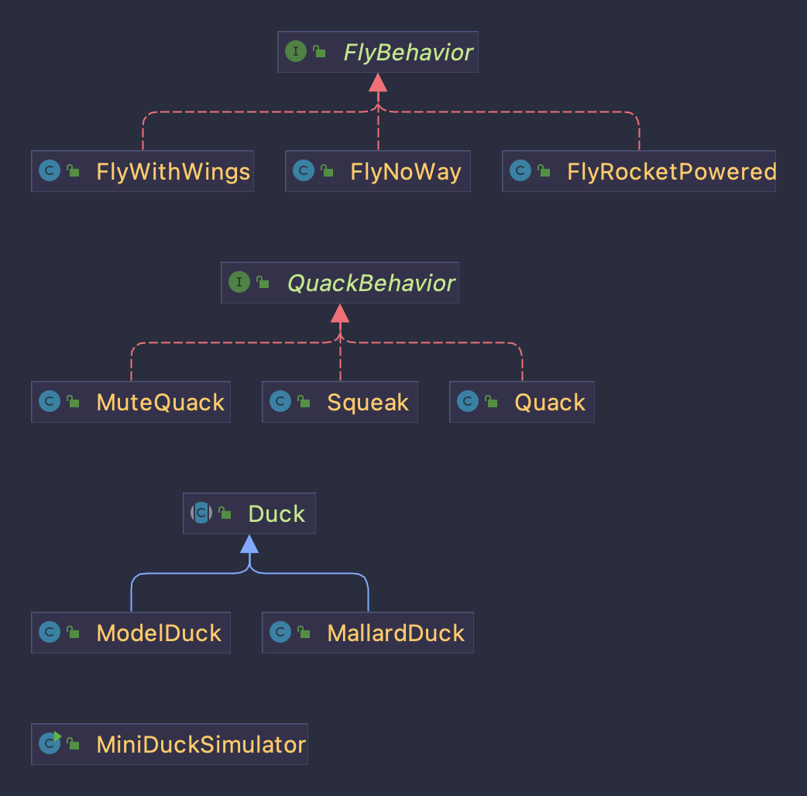
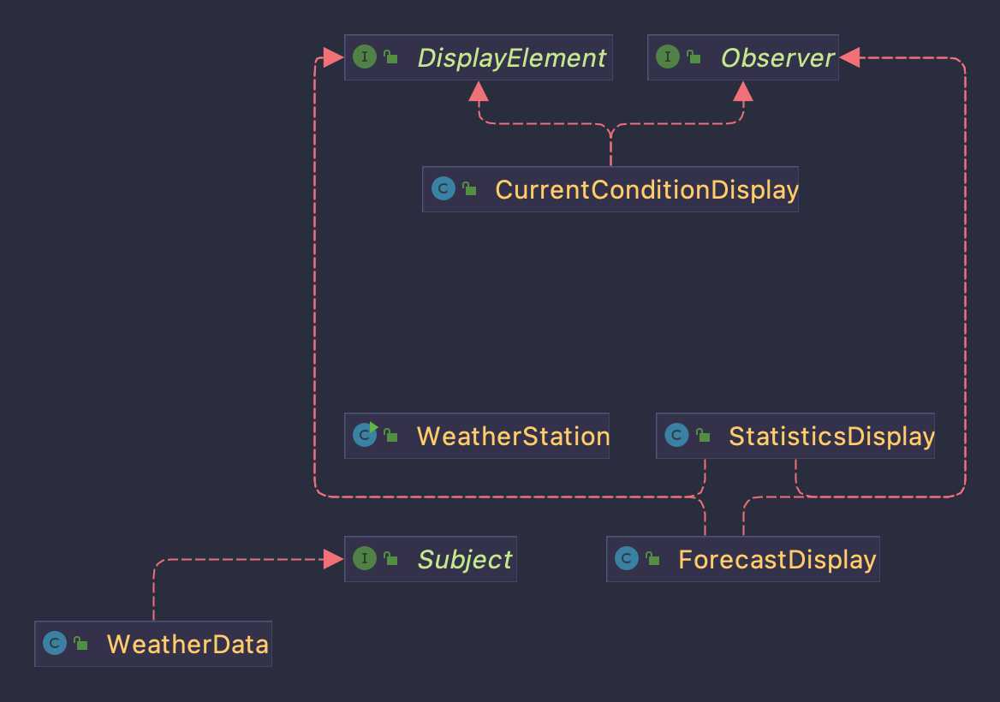
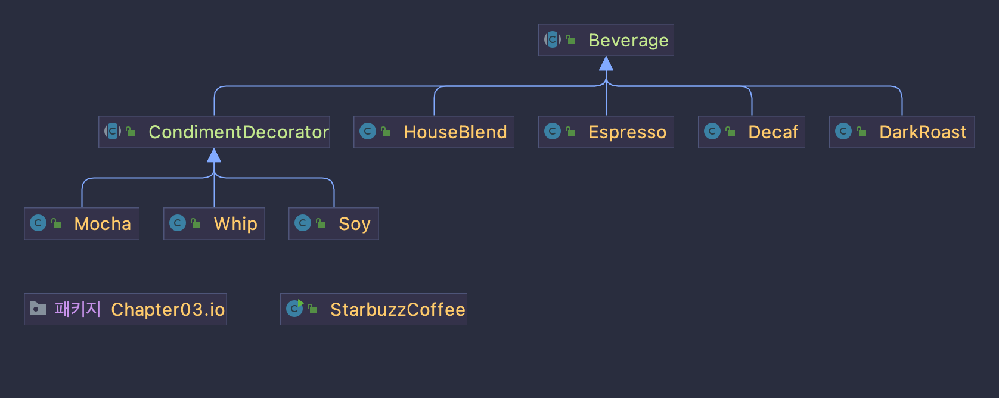

## 헤드 퍼스트 디자인 패턴 
### 디자인 원칙
1. 애플리케이션에서 달라지는 부분을 찾아내고, 달라지지 않는 부분과 분리한다.
   1. 달라지는 부분을 찾아서 나머지 코드에 영향을 주지 않도록 '캡슐화'한다. 그러면 나중에 바뀌지 않는 부분에는 영향을 미치지 않고 그 부분만 고치거나 확장할 수 있다.
2. 구현보다는 인터페이스에 맞춰서 프로그래밍 한다. (=상위 형식에 맞춰서 프로그래밍 한다.)
   1. 변수를 선언할때 보통은 추상 클래스나 인터페이스 같은 상위 형식으로 선언해야 한다. 객체를 변수에 대입할때 상위 형식을 구체적으로 구현한 형식이라면 어떤 객체든 넣을 수 있기 때문이다. 그러면 변수를 선언하는 클래스에서 실제 객체의 형식을 몰라도 된다.
3. 상속보다는 구성을 활용한다. 
   1. 구성을 활용할 경우, 유연성을 크게 향상시킬 수 있다.
4. 상호작용하는 객체 사이에는 가능하며 느슨한 결합을 사용해야 한다. 
5. 클래스는 확장에는 열려 있어야 하지만 변경에는 닫혀 있어야 한다.(OCP)
### 1장 전략 패턴(Strategy Pattern)
- 같은 기능이지만 서로 다른 전략을 가진 클래스들이 각각 캡슐화하여 상호교환할 수 있도록 하는 패턴 
- 기존 코드의 변경 없이도 실제 로직을 바꿀 수 있게 해주는 패턴 

 

### 2장 옵저버 패턴(Observer Pattern)
- 한 객체의 상태가 바뀌면 그 객체에 의존하는 다른 객체에게 연락이 가고 자동으로 내용이 갱신되는 방식으로 일대다 의존성을 정의합니다.
- 옵저버 패턴을 사용하면 주제가 데이터를 보내거나(푸시 방식) 옵저버가 데이터를 가져올(풀 방식) 수 있다.

#### 장점
1. 실시간으로 한 객체의 변경사항을 다른 객체에 전파할 수 있다.
2. **느슨한 결합**으로 시스템이 유연하고 객체 간의 의존성을 제거할 수 있다.
   - 느슨한 결합? 상호 작용하는 두 객체가 서로에 대해 잘 모른다는 것을 의미한다.

#### 단점
1. 너무 많이 사용하게 되면, 상태 관리가 힘들다.
2. 데이터 배분에 문제가 생기면 자칫 큰 문제로 이어질 수 있다.

### 3장 데코레이터 패턴(Decorator Pattern)
- 객체에 추가 요소를 동적으로 더할 수 있다.
- 데코레이터를 사용하면 서브 클래스를 만들때보다 훨씬 유연하게 기능을 확장할 수 있다.

 

