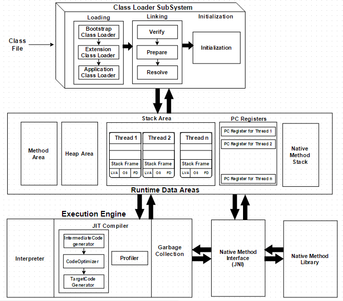
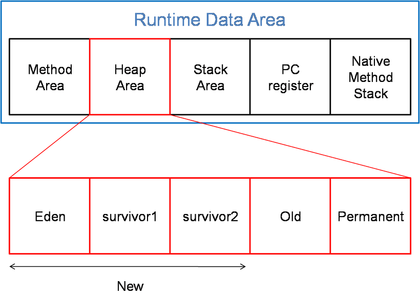

## JVM
- Java Virtual Machine의 약자로, 자바 가상 머신이라 부릅니다. 자바와 운영체제 사이에서 중개자 역할을 수행하며 자바가 운영체제에 구애받지 않고 프로그램을 실행할 수 있도록 도와줍니다. 
- 가비지 컬렉터를 사용한 메모리 관리도 자동으로 수행하며, 다른 하드웨어와 다르게 레지스터 기반이 아닌 스택 기반으로 동작 
 

 

JVM Architecture 

#### 메모리 구조
1. Class Loader
    - 자바에서 소스를 작성하면 Car.java처럼 .java파일이 생성된다.
    .java 소스를 자바 컴파일러가 컴파일하면 Car.class같은 .class 파일 (바이트 코드)가 생성된다.
    이렇게 <b>생성된 클래스 파일들을 엮어서 JVM이 운영체제로 할당받은 메모리 영역인 Runtime Data Area로 적재하는 역할을 Class Loader</b>가 한다.

 

2. Execution Engine
    - Class Loader에 의해 메모리에 적재된 클래스(바이트 코드)들을 기계어로 변경해 명령어 단위로 실행하는 역할
    - 실행방식 
        1. 인터프리터
            - 바이트 코드 명령어를 하나씩 읽어서 해석하고 실행
            - 중복되는 Byte Code에 대해서는 JIT 컴파일러 사용 
        2. JIT 컴파일러(Just-In-Time Compiler)
            - 인터프리터가 반복되는 코드를 발견하면 JIT컴파일러로 반복되는 코드를 모두 Native Code로 바꾼다. 그렇게 되면 반복된 Byte Code는 Native Code로 바뀌어 있기 때문에 인터프리터가 바로 사용할 수 있게 된다.

 

3. Garbage Collector
    - Heap 메모리 영역에 생성(적재)된 객체들 중에 <b>참조되지 않는 객체들을 탐색 후 제거하는 역할 </b>
        - GC의 동작시간은 일정하게 정해져 있지 않기 때문에 언제 객체를 정리할지는 알 수 없다. 
        - GC를 수행하는 동안 GC Thread를 제외한 다른 모든 Thread는 일시 정지 상태가 된다.

 

4. Runtime Data Area
    - JVM의 메모리 영역으로 자바 애플리케이션을 실행할때 사용되는 데이터들을 적재하는 영역
    1. Method Area(메소드 영역)
        - 모든 쓰레드가 공유하는 메모리 영역
            - 메모리 영역 : 클래스,인터페이스, 메소드, 필드, Static 변수 등의 바이트 코드를 보관
    2. Heap Area(힙 영역)
        - 모든 쓰레드가 공유하며, new키워드로 생성된 객체와 배열이 생성되는 영역
        - 메소드 영역에 로드된 클래스만 생성이 가능하고 Garbage Collector가 참조되지 않는 메모리를 확인하고 제거하는 영역
    3. Stack Area (스택 영역)
        - 지역 변수, 파라미터, 리턴 값, 연산에 사용되는 임시 값등이 생성
    4. PC Register (PC 레지스터)
        - 현재 쓰레드가 실행되는 부분의 주소와 명령을 저장하고 있는 영역
    5. Native Method Stack
        - 자바 외 언어로 작성된 네이티브 코드를 위한 메모리 영역

### Class Loader
- JRE의 일부로써 런타임에 클래스를 동적으로 JVM에 로드하는 역할을 수행하는 모듈 
- 클래스를 로드 할때는 parent-first/child-last의 순서로 로드하며, 캐시 → 부모 → 자식 순서로 클래스 로딩

#### 클래스 로더 로딩 과정

1. Loading(로딩)
    - .class 파일을 읽고, 그 내용에 따라 적절한 바이너리 데이터를 만들고 메소드 영역에 저장하는 동작을 수행
    - 로딩이 끝나면 해당 클래스 타입의 객체를 생성해서 메모리의 힙 영역(Heap Area)에 저장
2. Linking (링크)
    - 코드 내부의 레퍼런스를 연결하는 과정
    1. Verify(검증) : .class 파일 형식이 유효한지 검사
    2. Prepare(준비) : 클래스가 필요로 하는 메모리를 할당하고 클래스의 필드, 메서드, 인터페이스를 나타내는 데이터 구조 준비
    3. Resolve(분석) : 클래스 상수 풀 내 모든 <u> 심볼릭 레퍼런스</u>를 실제 메모리 레퍼런스로 교체
        - 심볼릭 레퍼런스? 메모리 번지의 참조를 의미하는 것이 아닌 이름에 의한 참조를 의미 
  
3. Initialization (초기화)
    - 클래스 로딩의 마지막 단계로, 모든 정적 변수가 자바 코드에 명시된 값으로 초기화 되며 정적 블록이 실행 
  
 

#### 클래스 3가지 기본 클래스 로더
1. Bootstrap Class Loader
    - JVM이 실행 될 때 실행되는 클래스 로더로, $JAVA_HOME/jre/lib에 있는 JVM을 실행할때 가장 기본이 되는 라이브러리를 로드하는 클래스 
2. Extension Class Loader
    - jre의 lib 폴더에 있는 ext 폴더에 있는 모든 확장 코어 클래스 파일들을 로드
    - Bootstrap의 child이다.
    - 별도의 CLASSPATH 설정 없이도 로딩 가능 

3. System Class Loader
    - 시스템 환경 변수 또는 클래스 변수 등과 같은 환경에 종속된 클래스들에 대한 로딩을 담당
    - 어플리케이션 레벨에 있는 클래스들을 로드
    - 사용자가 직접 정의한 클래스 파일들을 로드

4. User-Defined Class Loader
    - 애플리케이션 코드에 사용자가 직접 정의해서 사용하는 클래스 로더

#### 클래스 로더 3가지 원칙
1. Delegation(위임) : Java의 클래스는 필요할때 로딩되어야 한다는 원칙
2. Visibility(가시성) : Child 클래스는 Parent 클래스 로더에 의해 로딩된 클래스들을 확인할 수 있지만, 그역은 불가능하다는 원칙
3. Uniqueness (유일성) : 한번 클래스 로더에 의해 로딩된 클래스는 재로딩 되지 않는다.

> 클래스 로더 시스템 : 바이트 코드를 Bootstrap, Extension, Application 3가지 클래스 로더로 로딩하여
링코르 코드 내부의 레퍼런스를 연결하고 추가적으로 static 변수는 초기화 과정까지 거쳐
실행 엔진이 사용할 수 있도록 JVM 메모리의 메서드 영역에 적재하는 시스템

 

### GC 기본 동작 방식 이해 및 GC 기술의 변천사
#### Garbage Collector 과정
1. Garbage Collector가 Stack의 모든 변수를 스캔하면서 각각 어떤 객체를 참조하고 있는지 찾아서 마킹(Mark)
2. Reachable Object가 참조하고 있는 객체도 찾아서 마킹(Mark)
3. 마킹되지 않는 객체를 Heap에서 제거(Sweep)  
👉🏻 참조되지 않는 객체를 마킹하고 그 외에 것들은 제거

#### 그럼 언제 나타나는가?

  

1. New
    - 새로운 객체는 Eden 영역에 할당된다.
    - Eden 메모리가 전부 채워지게 될 경우 GC(Minor)이 발생하게 되고, Eden 영역의 Reachable 객체는 Survival1으로 옮겨 지게 된다. Eden 영역의 Unreachable 객체는 메모리에서 해제  
    이러한 과정이 반복되고, Servivor1 영역이 꽉차면 Servivor1영역에 대해서 Mark and Sweep 과정이 일어나게 된다. 
    - Survivor1에서 살아남은 객체들은 Survival2 영역으로 이동하고, 이동한 객체는 Age 값 증가  
    Eden 영역에서 GC가 발생하게 되면 살아남은 객체는 Servival2로 이동시켜준다.  
    결국, Survival 두 영역 중 하나의 영역은 비어있는 상태를 유지한다.
    - Survival2가 모두 가득 찼을 경우 Survival2 영역에 대해서는 Mark and Sweep가 일어나게 되고,
    Suervival2 영역에 있던 객체는 Survivor1 영역으로 이동하고, 이동한 객체는 Age 값 증가.  
    👉🏻 이렇게 특정 Age 값을 넘어서면 Old generation 영역으로 옮겨지게 되고, 이러한 과정을 Promotion이라 한다. 
     

2. Old
 - Old generation이 가득 차게 될 경우 Major Garbage Collector이 발생하게 된다.

 

### Reflection 동작 방식
#### 리플렉션(Reflection)
- 구체적인 클래스 타입을 알지 못해도 해당 클래스의 생성자, 메소드, 타입, 변수들에 접근할 수 있도록 해주는 JAVA API

#### 동작원리
- Java에서는 모든 .class 파일 하나당 java.lang.Class 객체를 하나씩 생성된다. Class는 모든 .class들의 정보를 가지고 있으며 .class 파일에 같이 저장된다. 모든 .class들은 이 클래스를 최초로 사용하는 시점에 서 동적으로 ClassLoader를 통해 JVM에 로드된다.
- 최초로 사용하는 시점은 해당 .class에 static을 최초로 사용할때를 의미  
  이렇게 .class의 정보와 Class 객체는 JVM에 Run Time Data Area의 Method Area에 저장된다.  
  이러한 정보는 java.lang.reflect에서 접근할 수 있게 도와준다.  
