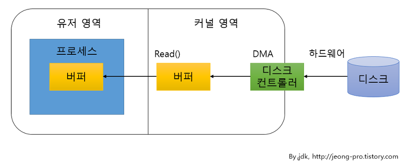

## NIO(New Input/Output)
- 채널 기반으로 채널을 양방향으로 입출력이 가능하여 입력과 출력을 위한 별도의 채널을 만들 필요가 없다.
- 기본적으로 버퍼를 사용해서 입출력을 하므로 IO보다 성능이 좋다.
- 블로킹과 넌블로킹 특징을 모두 가지고 있으며, IO 블로킹과의 차이점은 NIO블로킹은 스레드를 인터럽트 함으로써 빠져나올 수가 있다는 것이다. 
    넌블로킹은 입출력 작업 준비가 완료된 채널만 선택해서 작업 스레드가 처리하기 때문에 작업 스레드가 블로킹 되지 않는다.
- NIO는 버퍼, 채널, 셀렉터를 이용해 성능이 좋다.

### Why 나오게 되었는가?
- 커널 버퍼에서 JVM 내의 Buffer로 한번 더 데이터를 옮겨주는 과정이 생기면서 발생되는 문제점인 JVM 내부 버퍼로 복사 시 발생하는 CPU 연산, GC 관리, IO 요청에 대한 스레드 블록이 발생하는 현상 때문에 효율이 좋지 못한 점을 개선하기 위해 나온 패키지.

<p align="center"></p>

### 구성요소
1. 버퍼
   - 커널에 의해 관리 되는 시스템 메모리를 직접 사용할 수  있는  Buffer 클래스
   - Buffer vs Non-Buffer
     - IO는 기본적으로 버퍼를 지원하지 않기 때문에 버퍼를 제공해주는 보조 스트림인 BufferInputStream과 BufferedOutPutStream 이용
     - NIO는 기본적으로 버퍼가 지원되기 때문에 IO보다 성능이 좋다.
2. 채널
   - 비동기적으로 데이털르 읽거나 쓸 수 있다.
   - 입출력 수행시 블로킹(Blocking) 과 넌블로킹(Non-Blocking) 특징
   - 입출력이 가능하며 입출력을 위한 별도의 채널을 만들 필요가 없다.
   - 버퍼에 저장된 데이터를 출력하고 입력된 데이터를 버퍼에 저장
   - 읽은 데이터를 무조건 버퍼에 저장하기 때문에 버퍼 내에서 데이터의 위치를 이동해 가면서 필요한 부분만 읽고 쓸 수 있다.
3. 셀렉터
    - 하나의 Thread가 여러 개의 Input Channel을 모니터링 가능
    - 셀럭터에 채널을 등록하기 위해 반드시 해당 채널이 Non-Blocking 모드
    - 동작순서
      - 채널은 자신의 작업 유형을 키(SelectionKey)로 생성
      - 셀럭터의 관심 키셋에 키 등록
      - 셀럭터는 작업 처리 준비가 된 키 선택
      - 선택된 키셋에 별도로 저장
      - 작업 스레드는 선택된 키 셋에서 키를 하나씩 꺼냄

### 예제
1. 클라이언트
    ```java
    package TwoWeeks.Client;

    import java.io.IOException;
    import java.net.InetSocketAddress;
    import java.nio.ByteBuffer;
    import java.nio.channels.SocketChannel; // 클라이언트용
    import java.nio.charset.Charset;

    public class NIOBlockingClient {
        public static void main(String[] args) {
            SocketChannel socketChannel = null;

            try{
                socketChannel = SocketChannel.open();
                // 블로킹 설정(기본 설정이지만 명시적으로 설정하여 논블로킹과 구분)
                socketChannel.configureBlocking(true);

                System.out.println("연결 요청");
                // 서버 연결 요청(서버 IP와 포트 정보를 가진 InetSocketAddress 객체 매개값)
                // connect() 메서드는 연결이 완료 될때까지 블로킹, 완료되면 리턴
                socketChannel.connect(new InetSocketAddress("127.0.0.1", 4000));
                System.out.println("연결 성공");

                ByteBuffer byteBuffer = null;
                // 정적 메서드 forName()으로 Charset 인스턴스 생성
                // Charset : 인스턴스의 캐릭터 셋과 유니코드 사이의 변환을 처리하는 클래스
                Charset charset = Charset.forName("UTF-8");

                // encode() 메서드를 통해 유니코드로 변환하고 ByteBuffer에 담는다.
                byteBuffer = charset.encode("Hello Server");
                socketChannel.write(byteBuffer);
                System.out.println("데이터 보내기 성공");

                // 100개의 byte를 저장하는 ByteBuffer 생성
                byteBuffer = ByteBuffer.allocate(100);


                // socketChannel에서 읽은 byte들은 buteBuffer에 저장하고 읽은 바이트 수 리턴
                // 상대방이 SocketChannel의 close()를 호출하면 -1, 비정상적으로 종료되면 예외 발생
                int byteCount = socketChannel.read(byteBuffer);
                // 데이터를 읽기 위해 위치 속성값 변경
                byteBuffer.flip();

                String data = charset.decode(byteBuffer).toString();
                System.out.println("데이터 받기 성공 : " + data);

            }catch (Exception e){
                e.printStackTrace();
            }

            if(socketChannel.isOpen()){
                try{
                    socketChannel.close();
                }catch (IOException ee){
                    ee.printStackTrace();
                }
            }
        }
    }
    ```

2. 서버
   ```java
    package TwoWeeks.Server;

    import java.io.IOException;
    import java.net.InetSocketAddress;
    import java.nio.ByteBuffer;
    import java.nio.channels.ServerSocketChannel;
    import java.nio.channels.SocketChannel; // 서버용
    import java.nio.charset.Charset;

    public class NIOBlockingServer {
        public static void main(String[] args) {
            ServerSocketChannel serverSocketChannel = null;

            try{
                // ServerSocketChannel 객체 얻기 → 정적 메서드 open()사용
                serverSocketChannel = ServerSocketChannel.open();
                // 블로킹 설정(true이면 블로킹, false이면 논블로킹)
                serverSocketChannel.configureBlocking(true);
                // 포트에 바인딩 시키기(포트 정보를 가진 InetSocketAddress 객체 매개값)
                serverSocketChannel.bind(new InetSocketAddress(4000));

                while(true){ // 연결 수락을 위해 무한루프 작성
                    System.out.println("연결 기다리는중....");
                    SocketChannel socketChannel = serverSocketChannel.accept(); // 연결 수락(클라이언트가 연결 요청하기 전까지 블로킹)
                    // 연결된 클라이언트의 IP와 포트 정보 얻기
                    // getHostName() : 클라이언트 IP 리턴
                    // getPort() : 클라이언트 Port 번호 리턴
                    // toString() : "IP: 포트번호" 형태로 문자열 리턴
                    InetSocketAddress isa = (InetSocketAddress) socketChannel.getRemoteAddress();
                    System.out.println("연결 수락 : " + isa.getHostName());

                    // 소켓 채널로부터 데이터를 읽어들이는 코드 -> 클라이언트가 보낸 문자열을 얻는다.
                    ByteBuffer byteBuffer = null;
                    // 정적 메서드 forName()으로 Charset 인스턴스 생성
                    // forName("타입") : 직접 입력한 타입 간 변환을 해주는 객체 생성
                    Charset charset = Charset.forName("UTF-8");

                    /*
                        파일 IO를 자주 사용하면 allocate()를 크게 하나 만들어두고 계속사용
                        1. Capacity : 버퍼 전체 크기
                        2. Position :현재 버퍼를 쓰거나 읽을 위치, 파일 포인터의 개념과 같은 버퍼 포인터라고 생각하기!
                        3. Limit : 전체 크기 중에 실제 읽고 쓸 수 있는 위치를 따로 지정한 것은 기존에 Capacity와 동일하게 생성
                    */
                    byteBuffer = ByteBuffer.allocate(100);
                    int byteCount = socketChannel.read(byteBuffer);
                    byteBuffer.flip(); // flip으로 읽기 모드로 바꾼다.
                    /*
                        버퍼의 메소드
                        1. flip()
                            - 버퍼에 쓰여진 데이터를 읽어 올때 flip()를 사용한다. flip() 메소드를 호출하면 현재의 position 속성을 limit 속성으로 복사하고
                            position을 0으로 만듭니다. 이렇게 하면 버퍼에서 데이터를 가져올때 0부터 limit 속성값 직전까지 가져올 수 있게 된다.

                    */

                    // byteBuffer안에 바이트들을 UTF-8로 변환하고 문자열로 다시 변환
                    String data = charset.decode(byteBuffer).toString();
                    System.out.println("데이터 받기 성공 : " + data);

                    // 서버가 클라이언트로 데이터 전송
                    byteBuffer = charset.encode("Hello Client");
                    socketChannel.write(byteBuffer);
                    System.out.println("데이터 보내기 성공!!");
                }
            }catch (Exception e){
                e.printStackTrace();
            }

            if(serverSocketChannel.isOpen()){
                try{
                    serverSocketChannel.close();
                }catch (IOException ee){
                    ee.printStackTrace();
                }
            }
        }
    }
   ```

<br/>

### ServerSocketChannel 클래스와 SocketChannel 클래스
- net 패키지의 ServerSocket클래스와 Socket 클래스를 채널로서 다루고자할때 쓰는 SelectableChannel이다.
- 이들 네트워크 관련 채널들은 독자적으로 소켓의 역할을 대처하지 않는다. 대신 소켓 클래스를 내부에 가지고 있으면서 이들의 기능을 채널화하는데 적절히 이용하게 된다.

#### ServerSocketChannel 클래스
① ServerSocketChannel 클래스 생성 
  1. ServerSocketChannel 얻기
      ```java
      ServerSocketChannel server = ServerSocketChannel.open();
      ```

  2. 내부 소켓 얻기
      ```java
      ServerSocket socket = server.socket();
      ```
  3. bind 하기
      ```java
      SocketAddress addr = new InetSocketAddress(포트번호);
      socket.bind(addr);
      ```

② ServerSocketChannel 클래스 주요 메서드 <br/>
 - public abstract SocketChannel accept()
   - 이 채널의 소켓에 대한 접속을 받아들여 SocketChannel을 리턴
   - 이때 ServerSocketChannel이 Blocking I/O모드라면 accept()는 Blocking되지만 Non-Blocking I/O모드라면 Blocking되지 않는다. 따라서 당장 어떤 접속 요구가 없다면 null을 리턴
   - 하지만 리턴된 SocketChannel은 ServerSocketChannel이 Blocking I/O모드이든 아니는 상관없이 무조건 Blocking I/O모드로 시작된다.
 - public static ServerSocketChannel open()
   - ServerSocketChannel를 얻는다.
   - 이때 리턴된 ServerSocketChannel는 아직 bind되지 않는 상태이므로 소켓의 bind 메소드를 사용해 특정 주소의 binding을 해주어야 한다.
 - public final int validOps()
   - 현재 채널이 할 수 있는 해당 동작(ops)을 리턴.
   - 서버 소켓채널은 SelectionKey.OP_ACCETP만 할 수 있다.

<br/>

#### SocketChannel 클래스
① SocketChannel로 접속하기
- 소켓 채널을 얻기 위해서는 open() 메서드를 사용하면 되는데 open()에는 인자가 있는것과 없는것이 있다. 만약 인자 없이 open()를 사용한다면 접속이 되지 않는 소켓 채널을 리턴하므로 connect()메서드를 이용해서 접속을 해주어야 한다. 인자로 SocketAddress 객체를 준다면 접속이 된 소켓 채널을 얻을 수 있다.

    1. 접속된 소켓 채널 얻기
        ```java
        SocketAddress addr = new InetSocketAddress("IP주소", 포트번호);
        SocketChannel socket = SocketChannel.open(addr);
        ```
    2. connect() 사용해서 접속하기
        ```java
        SocketAddress addr = new InetSocketAddress("ip주소", 포트번호);
        SocketChannel socket = SocketChannel.open();
        socket.connect(addr);
        ```
- SocketChannel에서 Non-Blocking I/O모드일 경우에는 open(SocketAddress addr)해도 되지만, open()해서 connect(SocketAddress addr)했을 경우에는 즉시 연결 작업이 끝나지 않을 수 있어서 이 메서드가 false를 리턴하게 되므로, finishConnect()로 연결작업을 끊어줘야 한다. 만약 연결이 제대로 안되었다면 false가 리턴된다. Blocking I/O모드일때는 connect()호출이 Blocking 되면 연결이 끊길때까지 지속된다.

② SocketChannel 클래스 주요 메서드 <br/>
  - public abstract boolean connect(SocketAddress remote)
    - 인자로 들어온 SocketAddress 객체 정보를 가지고 현재 채널에 소켓을 접속한다. 연결이 제대로 안되면 false를 리턴
  - public abstract boolean finishConnect()
    - 소켓 채널의 접속 처리를 완료한다.
  - public static SocketChannel open()
    - 접속되지 않는 소켓 채널을 리턴
  - read()류 메서드
    - public abstract int read(ByteBUffer dst)
    - public final long read(ByteBUffer[] dsts)
    - public abstract long read(ByteBuffer[] dsts, int offset, int length)
  - write()류 메서드
    - public abstract int write(ByteBuffer src)
    - public final long write(ByteBUffer[] srcs)
    - public abstract long write(ByteBuffer[] srcs, int offset, int length)

#### 예제
1. 서버
   1. 채널들을 관리할 Selector를 얻는다.
        ```java
        Selector selector = Selector.open();
        ```
   2. ServerSocketChannel를 얻는다.
        ```java
        ServerSocketChannel server = ServerSocketChannel.open();
        ```
   3. 내부 소켓을 얻는다.
        ```java
        ServerSocket socket = server.socket();
        ```
   4. binding 한다.
        ```java
        SocketAddress addr = new InetSocketAddress(포트번호);
        socket.bind(addr);
        ```
   5. ServerSocketChannel을 Selector에 등록시킨다. ServerSocket는 OP_ACCEPT동작만 할 수 있다.
        ```java
        server.register(selector, SelectionKey.OP_ACCEPT);
        ```
   6. 클라이언트의 접속을 대기한다. 이때 접속이 되면 accept()에 의해 상대방 소켓과 연결된 SocketChannel의 인스턴스를 얻는다. 이채널은 읽기(OP_READ), 쓰기(OP_WRITE), 접속(OP_CONNECT) 행동을 지원
        ```java
        SocketChannel socketchannel = serverChannel.accept();
        ```
   7. 접속된 SocketChannel를 Selector에 등록한다.
        ```java
        socketChannel.register(selector, 소켓채널의 해당행동);
        ```
   8. 채널이 취할 수 있는 3가지 동작(읽기,쓰기,접속)에 대해 검사한다.  
      1. isConnectable()
           - true이면 상대방 소켓과 새로운 연결이 됐다는 뜻
           - 이때 Non-Blocking I/O모드일 경우에는 연결과정이 끝나지 않는 상태에서 리턴될 수도 있다. 그러므로 SocketChannel의 isConnectionPending()메서드가 true를 리턴하는지 아닌지를 보고 true를 리턴한다면 finsihConnection()를 명시적으로 불러서 연결을 마무리 짓도록 한다.
       1. isReadable()
            - true이면 읽기(OP_READ)동작이 가능하다는 뜻으로 SocketChannel로부터 데이터를 읽는것에 관한 정보를 받을 준비가 되었다는 뜻이다. 따라서 버퍼에 읽어들이기만 하면 된다.
       2. isWritable() 
            - true이면 쓰기(OP_WRITE)동작이 가능하다는 뜻으로 SocketChannel에 데이터를 쓸 준비가 되었다는 뜻이다. 따라서 버퍼의 데이터를 이채널에 write()하면 된다.
<br/>

2. 클라이언트
   1. SocketChannel를 얻어서 접속한다.
        ```java
        SocketAddress addr = new InetSocketAddress("localhost", 8080);
        SocketChannel socket = SocketChannel.open(addr);
        ```
   2. 버퍼를 만들고 서버에서 들어온 데이터를 읽고 쓰기를 한다.