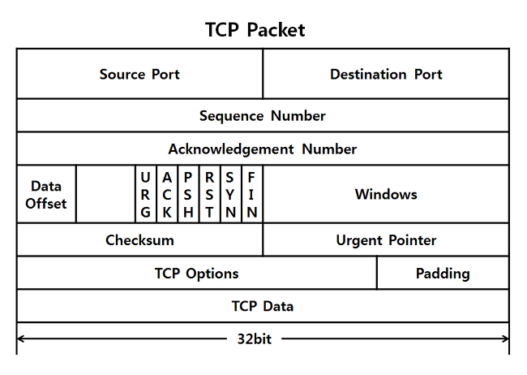

## TCP/UDP
### TCP(Transmission Control Protocol)
- IP 프로토콜 위에서 연결형 서비스를 지원하는 전송 계층 프로토콜
- 제공하는 주요 기능
    - 연결형 서비스 제공
    - 전이중(Full Duplex) 방식의 양방향 가상 회선 제공
    - 신뢰성 있는 데이터 전송 보장
- TCP는 데이터를 세그먼트(Segment)라는 블록 단위로 분할해 전송
- 전송되는 블록의 크기는 네트워크 부하정도, 윈도우 크기 등의 영향을 받으며, 가변 크기를 지원
- 세그먼트를 하나의 단위로 간주하여 순서 번호를 관리

#### TCP 헤더 구조
- 중간에 위치한 여덟개의 플래그 비트를 비롯해 많은 필드를 사용하므로 데이터 전송 과정이 UDP보다 복잡하다.
- 마지막 줄의 Options 와 Padding은 생략할 수 있으므로 TCP 헤더의 최소 크기는 20byte

- Source Port / Destination Port(송신 포트 / 수신 포트)
  - TCP로 연결되어 있는 가상 회선 양단이 송수신 프로세스에 할당된 네트워크 포트 주소
  - 포트 번호는 TCP와 UDP가 별도의 주소 공간을 갖기 때문에 같은 번호를 독립적으로 사용 할 수 있다.
- Sequence Number(순서 번호)
  - 송신 프로세스가 지정하는 순서번호
  - 세그먼트 전송 과정에서 전송되는 바이트의 수를 기준으로 증가
    → TCP에서는 전송 데이터의 각 바이트마다 순서 번호 존재!
- Acknowledgement Number(응답번호)
  - 수신 프로세스가 제대로 수신한 바이트의 수를 응답하기 위해 사용
  - 필드 값은 ACK 플래그 비트가 지정된 경우에만 유효하며 다음에 수신을 기대하는 데이터의 순서번호를 표시 
  - ACK 응답을 받은 송신 프로세스는 Acknowledgement Number -1 까지의 모든 데이터가 올바르게 전송되었음을 확인
- Data Offset(데이터 옵셋)
  - TCP 세그먼트가 시작되는 위치를 기준으로 데이터의 시작 위치를 나타내므로 TCP 헤더의 크기가 된다.
- Reserved(예약)
  - 예약 필드
- Window(윈도우)
  - 슬라이딩 윈도우 프로토콜에서 수신 윈도우 버퍼 크기를 지정하려고 사용하며, 수신 프로세스가 수신할 수 있는 바이트의 수를 표시
  - 수신 프로세스의 버퍼 용량 초과 등으로 인해 데이터를 더이상 수신할 수 없으면 Window 필드 값을 0으로 지정
- Checksum(체크섬)
  - TCP 세그먼트에 포함되는 프로토콜 헤더와 데이터 모두에 대한 변형 오류를 검출하려고 사용
  - IP 프로토콜에서 사용하는 오류 검출 알고리즘 사용
- Urgent Pointer(긴급 포인터)
  - 긴급 데이터를 처리하기 위한 것 

### UDP(User Datagram Protocol)
- IP 프로토콜을 이용해 비연결형 서비스를 지원하는 UDP는 작지만 빠른 전송이 가능
- 주요 특징
  - 비연결형 서비스 제공
  - 헤더와 전송 데이터에 대한 체크섬 기능을 제공
  - Best Effort 전달 방식 지원
- 상위 계층에서 받은 데이터를 IP 프로토콜에 전달하지만, 전송한 데이터그램의 목적지까지 제대로 도착했는지 확인하지 않는다. 

#### UDP 헤더 구조
- TCP 보다 단순해 의미와 기능을 쉽게 파악 가능
- 프로토콜에서 수행하는 기능도 간단해 프로토콜의 오버헤드가 작은 편

- Source Port / Destination Port(송신 포트 /수신 포트)
  - 송수신 프로세스에 할당된 네트워크 포트 번호
  - UDP 포트 번호는 TCP 포트번호와 독립적으로 관리되고 할당된다.
- Length(길이)
  - 프로토콜 헤더를 포함한 UDP 데이터 그램의 전체 크기
- Checksum(체크섬)
  - 프로토콜 헤더와 데이터에 대한 체크섬 값을 제공하여 수신 프로세스가 데이터그램 변형 오류를 감지할 수 있다.
  - IP 프로토콜은 헤더만 체크섬을 계산하지만, UDP는 데이터까지 체크섬 계산. 