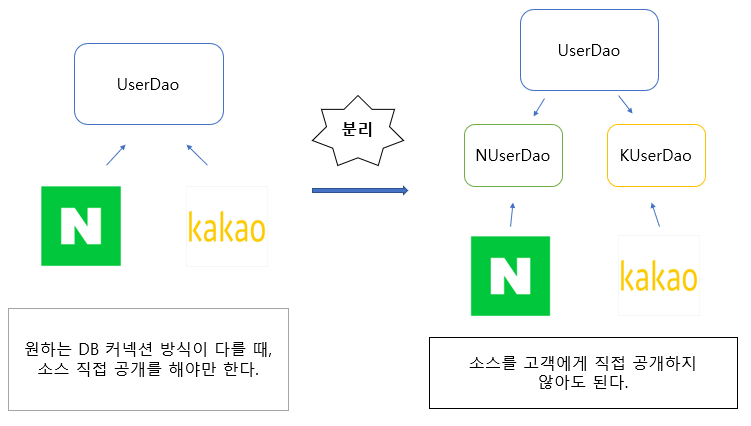

# 1장_오브젝트와 의존 관계

### Spring이란 무엇인가?
- 스프링은 자바 엔터프라이즈 애플리케이션 개발에 사용되는 애플리케이션 프레임워크.
  - 애플리케이션 프레임워크란?
    - 애플리케이션 개발을 빠르고 효율적으로 할 수 있도록 애플리케이션의 바탕이 되는 틀과 공통 프로그래밍 모델, 기술 API 등을 제공해준다.

- 스프링 컨테이너
  - 설정 정보를 참고해서 애플리케이션을 구성하는 오브젝트를 생성하고 관리한다.
  - 독립적으로 동작할 수도 있지만 보통 웹 모듈에서 동작하는 서비스나 서블릿으로 등록해서 사용한다.

- 공통 프로그래밍 모델(IoC/DI, 서비스 추상화, AOP)
    - IoC/DI라고 불리는 오브젝트의 생명주기와 의존 관계에 대한 프로그래밍 모델이다. 
    - 구체적인 기술과 환경에 종속되지 않도록 유연한 추상 계층을 두는 방법
    - AOP는 애플리케이션 코드에 산재해서 나타나는 부가적인 기능을 독립적인 모듈화하는 프로그래밍 모델이다.

### 1.2 DAO의 분리
- 프로그램의 기초 개념 중 **관심사의 분리** 라는게 있는데, 이를 객체지향에 적용해보면, 관심이 같은 것끼리 하나의 객체 안으로 또는 친한 객체로 모이게 할 수 있고, 관심이 다른 것은 가능한 따로 떨어져서 서로 영향을 주지 않도록 분리하는 것입니다.

    
     
    위의 그림과 같이 슈퍼 클래스에 기본적인 로직의 흐름을 만들고, 그 기능의 일부를 추상 메소드로 만든 뒤 서브 클래스에서 이런 메소드를 필요에 맞게 구현해서 사용하도록 만드는 방법을 템플릿 메소드 패턴이라 합니다. 템플릿 메소드 패턴은 스프링에서 애용되는 디자인 패턴

- 템플릿 메소드 패턴
  - 상속을 통해 슈퍼클래스의 기능을 확장 할때 사용하는 가장 대표적인 방법
  - 슈퍼클래스에서는 미리 추상 메소드 또는 오버라이드 가능한 메소드를 정의해두고 이를 활용해 코드의 기본 알고리즘을 담고 있는 템플릿 메소드는 만든다. 서브 클래스에서는 추상 메소드를 구현하거나, 훅 메소드를 오버라이드 하는 방법을 이용해 기능의 일부를 확장한다. 

- 팩토리 메소드 패턴
  - 이 메소드는 주로 인터페이스 타입으로 오브젝트를 리턴하므로 서브클래스에서 정확히 어떤 클래스의 오브젝트를 만들어 리턴할지는 슈퍼클래스에서는 알지 못한다.
  - 서브 클래스에서 오브젝트 생성 방법과 클래스를 결정할 수 있도록 미리 정의해둔 메소드를 팩토리 메소드라 하고, 이 방식을 통해 오브젝트 생성 방법을 나머지 로직, 즉 슈퍼클래스의 기본 코드에서 독립시키는 방법을 팩토리 메소드 패턴이라 한다.

### 1.3 DAO의 확장
- 추상화란 어떤 것들의 공통적인 성격을 뽑아내어 이를 따로 분리해내는 작업이다. 자바가 추상화를 위해 제공하는 가장 유용한 도구는 바로 인터페이스다. 인터페이스는 자신을 구현한 클래스에 대한 구체적인 정보는 모두 감춰버린다.
- 인터페이스는 어떤 일을 하겠다는 기능만 정의해 놓은 것으로, 어떻게 하겠다는 구현 방법은 나타나 있지 않다.

#### 1.3.4 원칙과 패턴
- 여기에 나오는 용어들은 스프링을 할때 자주 등장하므로 기억하기!

  #### 개방 폐쇄 원칙
  - 깔끔한 설계를 위해 적용 가능한 객체지향 설계 원칙 중 하나다. 
    → 클래스나 모듈은 확장에는 열려 있어야 하고 변경에는 닫혀 있어야 한다!
  - 객체지향 설계 원칙(SOLID)  
    1. 단일 책임 원칙(Single Responsiblity Principle)
        - 모든 클래스는 각각 하나의 책임만 가져야 한다. 클래스는 그 책임을 완전히 캡슐화 해야 함을 말한다.
        - 이처럼 변경 사항이 있을때, 애플리케이션의 파급 효과가 적으면 SRP 원칙을 잘 따른 것으로 볼 수 있다.
    2. 개방 폐쇄 원칙(Open Closed Principle)
        - "높은 응집도"와 "낮은 결합도"라는 원리로 설명할 수 있다.
        1) 높은 응집도
            - 응집도가 높다는 건 하나의 모듈, 클래스가 하나의 책임 또는 관심사에만 집중되어 있다는 뜻으로, 같은 책임, 관심사를 기반으로 하나의 객체로 설계하기 때문에 객체에 변경이 발생하더라도 다른 곳에 미치는 영향이 제한 적인 것을 뜻한다.
        2) 낮은 결합도
            - 책임과 관심사가 다른 오브젝트 또는 모듈과는 낮은 결합도 즉, 느슨하게 연결된 형태를 유지하는 것이 바람직하며, 느슨한 연결은 관계를 유지하는데 꼭 필요한 최소한의 방법만 간접적인 형태로 제공하고, 나머지는 서로 독립적이고 알 필요도 없게 만들어주는 것이다.
            - 하나의 변경이 발생할때 마치 파문이 이는 것처럼 여타 모듈과 객체로 변경에 대한 요구가 전파되지 않는 상태를 말한다.
            - 결합도란?
              - '하나의 오브젝트가 변경이 일어날때에 관계를 맺고 있는 다른 오브젝트에게 변화를 요구하는 정도'
   

    #### 전략 패턴
    - 디자인 패턴의 꽃이라 불릴만큼 다양하게 자주 사용되는 패턴
    - 자신의 기능 맥락에서, 필요에 따라 변경이 필요한 알고리즘을 인터페이스를 통해 통째로 외부로 분리시키고, 이를 구현한 구체적인 알고리즘 클래스를 필요에 따라 바꿔서 사용할 수 있게 하는 디자인 패턴을 뜻한다. 

 

#### 1.4 제어의 역전(IoC)
- 간단히 프로그램의 제어 흐름 구조가 뒤바뀌는 것

  
   
  - 일반적인 상황에서는 개발자가 직접 객체를 제어해야 했다. new 연산자를 통해 객체를 생성하고, 객체의 의존성을 맺어주는 등등.. 하지만 Spring에서는 XML 파일 또는 어노테이션 방식으로 스프링 컨테이너에 Bean(객체)를 등록해주면 스프링 컨테이너에서 Bean의 생명 주기를 전부 관리해준다

- 프레임워크도 제어의 역전 개념이 적용된 대표적인 기술이다.
  
  | | 프레임워크 | 라이브러리 |
  |:---:|:---:|:----:|
  |특징| 특정 프로그램을 개발하기 위한 여러 요소들과 메뉴얼인 룰을 제공하는 프로그램 | 프로그램을 개발하기 위해 쓰는 도구들 |
  | 공통점 | 프로그램을 개발하기 위해 쓰는 공구와 같은 도구들 |프로그램을 개발하기 위해 쓰는 공구와 같은 도구들 |
  | 차이점 | 꼭 써야하는 것과 지켜야하는 룰이 있다 | 상관 없다 |

 

#### 1.5 스프링의 IoC
1. 빈(Bean)
   - 빈 또는 빈 오브젝트는 스프링이 IoC 방식으로 관리하는 오브젝트라는 뜻이다. 
   - 스프링이 직접 생성과 제어를 담당하는 오브젝트만을 빈이라 부른다.

2. 빈 팩토리(Bean factory)
   - 스프링의 IoC를 담당하는 핵심 컨테이너를 가리킨다.
   - 빈을 등록하고, 생성하고, 조회하고, 돌려주고, 그 외에 부가적인 빈을 관리하는 기능을 담당한다. 
   - 보통은 이 빈 팩토리를 바로 사용하지 않고 이를 확장한 애플리케이션 컨텍스트를 이용한다. BeanFactory라고 붙여쓰면 빈 팩토리가 구현하고 있는 가장 기본적인 인터페이스의 이름이 된다. 이 인터페이스에 getBean()과 같은 메소드가 정의되어 있다.

3. 애플리케이션 컨텍스트(Application context)
  - 빈 팩토리를 확장한 IoC 컨테이너다.
  - 빈을 등록하고 관리하는 기본적인 기능 + 스프링이 제공하는 각종 부과 서비스를 추가로 제공
  - ApplicationContext라고 적으면 애플리케이션 컨텍스트가 구현해야하는 기본 인터페이스를 가리키는 것이기도 하며, ApplicationContext는 BeanFactory를 상속한다.
  
4. 설정정보/설정 메타정보(Configuration metadata)
  - 애플리케이션 컨텍스트 또는 빈 팩토리가 IoC를 적용하기 위해 사용하는 메타정보

5. 컨테이너(Container) 또는 IoC 컨테이너
   - IoC 방식으로 빈을 관리한다는 의미에서 애플리케이션 컨텍스트나 빈 팩토리를 컨테이너 또는 IoC 컨테이너라 한다.
  
#### 1.7 의존관계 주입(DI)
- 컨테이너에서 관리할 객체를 지정해주고, 코드 내에서는 컨테이너에서 객체를 받아 사용하는 방식
- 빈을 정의할때 객체 간 의존 관계를 명시해 코드에서 사용 시 자동으로 주입받도록 함
  
  #### 의존 관계 주입
  - 구체적인 의존 오브젝트와 그것을 사용할 주체, 보통 클라이언트라고 부르는 오브젝트를 런타임 시에 연결해주는 작업
  - 의존 관계 주입의 핵심은 설계 시점에는 알지 못했던 두 오브젝트의 관계를 맺도록 도와주는 제3의 존재가 있다는 것이다. DI에서 말하는 제3의 존재는 바로 관계설정 책임을 가진 코드를 분리해서 만들어진 오브젝트라 볼 수 있다.
  - 스프링의 애플리케이션 컨텍스트, 빈 팩토리, IoC 컨테이너 등이 모두 외부에서 오브젝트 사이의 런타임 관계를 맺어주는 책임을 지닌 제3의 존재라고 볼 수 있다.

    ##### 의존 관계주입 조건
    1. 클래스 모델이나 코드에는 런타임 시전의 의존관계가 드러나지 않는다.  
        그러기 위해서는 인터페이스에만 의존하고 있어야 한다.
    2. 런타임 시점의 의존관계는 컨테이너나 팩토리 같은 제3의 존재가 결정한다.
    3. 의존관계는 사용할 오브젝트에 대한 레퍼런스를 외부에서 제공(주입)해줌으로써 만들어진다.

  #### 의존관계 검색
  - 의존관계를 맺는 방법이 외부로부터의 주입이 아니라 스스로 검색을 이용
  - 런타임 시 의존관계를 맺을 오브젝트를 결정하는 것과 오브젝트의 생성작업은 외부 컨테이너에게 IoC로 맡기지만, 이를 가져올 때는 메소드나 생성자를 통한 주입 대신 스스로 컨테이너에게 요청하는 방법을 사용.
  - 의존관계 검색 방식에서는 검색하는 오브젝트는 자신이 스프링의 빈일 필요가 없다는 점이다.
